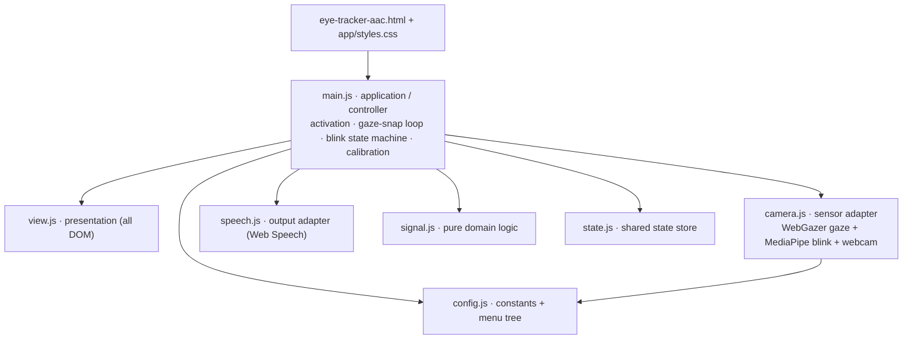

# EyeSpeak

**[▶ Live demo](https://hamzas-github.github.io/eyespeak/).** Open it in Chrome, allow the camera, and talk with your eyes.

A webcam eye-tracking communication board (AAC). You look at a card and blink on purpose, and it speaks the phrase out loud. Real-time gaze tracking and blink detection run entirely in the browser, on-device. No install, no account, nothing leaves the page.

`Real-time computer vision` · `WebGazer` · `MediaPipe Face Landmarker` · `WebAssembly` · `Web Speech API` · `getUserMedia` · `Accessibility / AAC` · `Vanilla JS`

## What it does

- **Four big targets at a time.** The board groups into Yes, No, Food, and Pain. Food and Pain open a small sub-menu (water, hunger, drink / pain, toilet, medication) with a Back card. Bigger cards mean rough gaze still lands on the right one.
- **Gaze cursor snaps** to the nearest card, so jitter from the webcam tracker doesn't matter much.
- **Blink to select.** A deliberate, both-eyes-closed blink past your calibrated threshold picks the highlighted card. A ring fills while your eyes are shut so you can see it registering.
- **Ignores noise.** Quick natural blinks, one eye, long closures, and gaze drifting between cards all do nothing.
- **Speaks and logs** every selection for a caregiver in the room.
- **Works without the camera.** Mouse, touch, and keyboard all work too (Space selects the gazed card, Enter the focused one).

## How it works

One webcam stream feeds two models that both run on-device:

- **WebGazer** estimates where you're looking and drives the cursor. A short look-at-the-dots routine trains its regression when the camera starts, and every selection re-trains it, so accuracy improves with use. A median filter smooths out the raw signal.
- **MediaPipe Face Landmarker** reads per-eye eyelid closure from facial blendshapes. A quick open/closed calibration sets the threshold that tells a deliberate blink apart from an ordinary one.

If the camera or WebGazer fails, it falls back to mouse-position gaze with keyboard and touch control.

## Architecture

The app is split into small ES modules along clean layers, so the domain logic stays pure and the browser/hardware boundaries sit behind thin adapters. `main.js` is the only module that depends on the others.



- **Domain** (`config.js`, `signal.js`, `state.js`): data and pure, side-effect-free logic (thresholds, the blink window, the median filter, bounds checks). No DOM.
- **Adapters** (`camera.js`, `speech.js`): isolate the hardware and browser APIs (WebGazer, MediaPipe, getUserMedia, Web Speech) behind small interfaces.
- **Presentation** (`view.js`): the only module that reads or writes the DOM.
- **Application** (`main.js`): the controller that wires everything, owning selection, the gaze-snap loop, the blink state machine, and the calibration flow.

The pure logic is covered by a Playwright browser suite (`npm test`) plus in-page `?selftest` assertions.

## Run it locally

Self-contained static site: the HTML, the ES modules in `app/`, and the vendored libraries in `vendor/`. They load as ES modules and WebAssembly, so serve it over HTTP. Opening the file directly won't work.

```bash
python -m http.server 8123
# open http://localhost:8123/eye-tracker-aac.html
```

`localhost` and any HTTPS host count as secure contexts, so the camera works.

## Roadmap

Done:

- [x] Webcam gaze tracking (WebGazer) with snake-path calibration and online learning
- [x] Deliberate-blink selection (MediaPipe Face Landmarker) with per-eye calibration
- [x] Two-level board with four big targets for low-accuracy gaze
- [x] Spoken output and a session caregiver log
- [x] Mouse, touch, and keyboard fallback
- [x] Fully on-device; nothing leaves the browser
- [x] Layered ES-module architecture with a browser test suite
- [x] Live demo on GitHub Pages

Next:

- [ ] Dedicated eye-tracking hardware for precise, stable gaze instead of a webcam
- [ ] Hospital-system integration so a selection reaches staff instantly, not just the room
- [ ] Escalation routing by need: medication notifies a nurse, food reaches the kitchen/aide, pain alerts a doctor
- [ ] Selection history with timestamps, acknowledgement, and follow-up tracking

## Built with

Vanilla JavaScript, no build step · [WebGazer.js](https://webgazer.cs.brown.edu/) · [MediaPipe Tasks Vision](https://ai.google.dev/edge/mediapipe) · Web Speech API · Playwright for browser tests.
